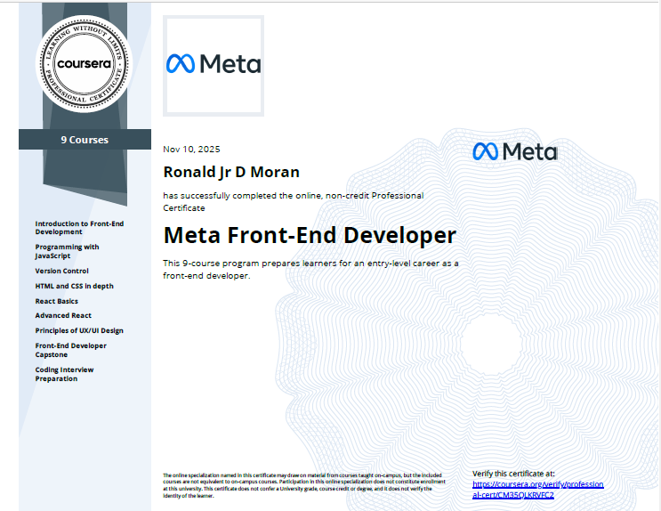

---

I build real-world web & mobile applications that automate tasks, manage data, and solve real daily problems using React, Node.js, Firebase, and modern web technologies.

---

<table>
<tr>
<td width="50%" valign="top">

## 🛠️ Tech Stack

### Languages

### Frameworks & Libraries

### Backend & Tools

</td>
<td width="50%" valign="top">

## 🎓 Certifications

#### Meta Professional Certificates
- ✅ [Meta Full Stack Developer](https://coursera.org/verify/specialization/FM7YDT2H0GG5) - Meta Professional Certificate
  
- ✅ [Meta Front-End Developer Professional Certificate](https://coursera.org/share/f0d70fac1ddb97156a1b666f42b0fe55)
  
- ✅ [Advanced React](https://coursera.org/share/eb6df70c9c3564b5b3fd279d841efd4c) - Meta
  

#### Other Certifications
- ✅ [Git and GitHub](https://www.udemy.com/certificate/UC-53ffcce1-4250-4c9a-b935-09e6d235e521/) - Udemy
  

</td>
</tr>
</table>

---

